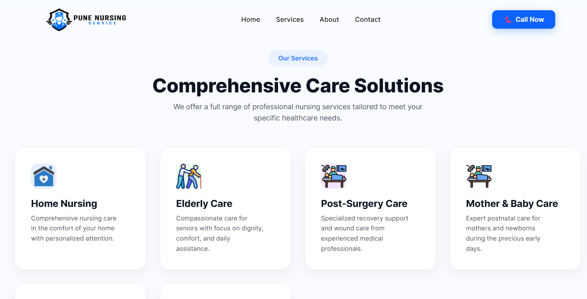
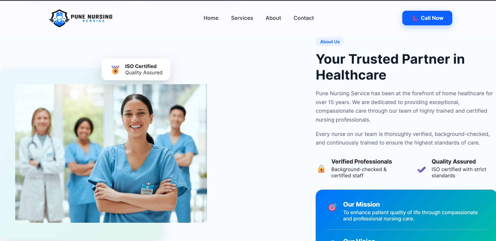
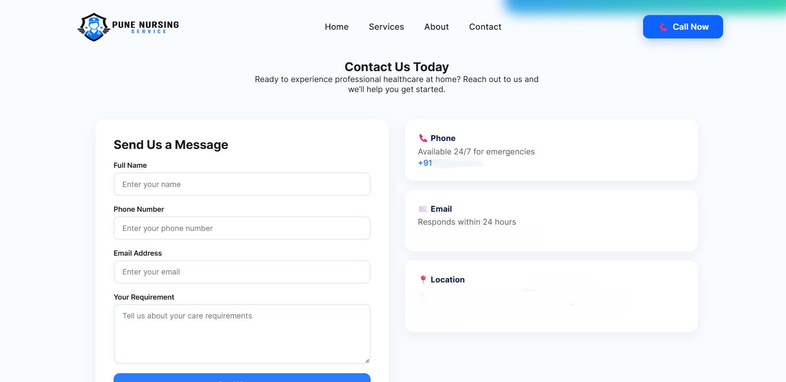

<h1 align="center">🏥 Pune Nursing Service Website</h1>

A modern healthcare service website designed to provide professional home nursing care information and enable patients to easily connect with certified nursing professionals.

## 📌 Overview

The Pune Nursing Service website is a professional healthcare service platform designed to showcase home nursing services and allow patients to easily connect with healthcare professionals.

The website focuses on providing clear information about nursing services, building trust with patients, and enabling easy contact for healthcare assistance.

Core concepts demonstrated in this project:

• Modern responsive website design 
• Healthcare service presentation 
• User-friendly navigation structure 
• Professional landing page design 
• Contact and inquiry form integration 

The platform is designed to help patients and families easily find reliable nursing care services at home.

---

## 🧩 Features

• Professional Landing Page 
• Clean and modern healthcare-themed UI 
• Hero section with service highlights and call-to-action buttons 

• Services Section 
• Displays different nursing services offered 
• Home Nursing 
• Elderly Care 
• Post-Surgery Care 
• Mother & Baby Care 

• About Section 
• Company overview and mission statement 
• Highlights experience and professional standards 
• Displays certifications and trust indicators 

• Contact Section 
• Inquiry form for patient requirements 
• Phone, email, and location details 
• Easy communication with service providers 

• Call-to-Action Elements 
• "Book a Nurse" button 
• Direct call option for emergencies 

---

## 🛠 Tech Stack

• Frontend: HTML5 
• Styling: CSS3 
• Layout: Responsive design principles 
• Icons & UI Assets: Modern healthcare-themed icons 
• Tools: VS Code, Git, GitHub 

---

## ⚙️ Setup Instructions

**1️⃣ Clone the Repository**

git clone https://github.com/yourusername/pune-nursing-service.git

cd pune-nursing-service

**2️⃣ Open the Project**

Open the project folder in VS Code or any code editor.

**3️⃣ Run the Website**

Simply open the `index.html` file in your browser.

---

## 🖼️ Screenshots

### 🏥 Homepage Hero Section

  

---

### 💙 Services Section

  

---

### 👩‍⚕️ About Section

  

---

### 📞 Contact Section

  

---

## 📌 Future Improvements

• Online nurse booking system 
• Patient dashboard 
• Appointment scheduling system 
• Admin panel for service management 
• Integration with hospital management systems 
